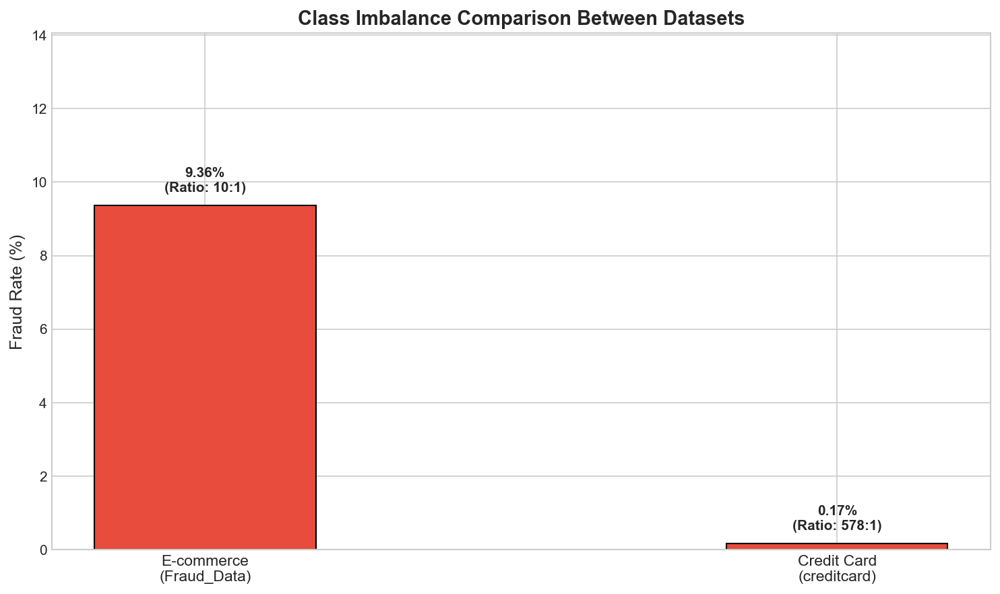
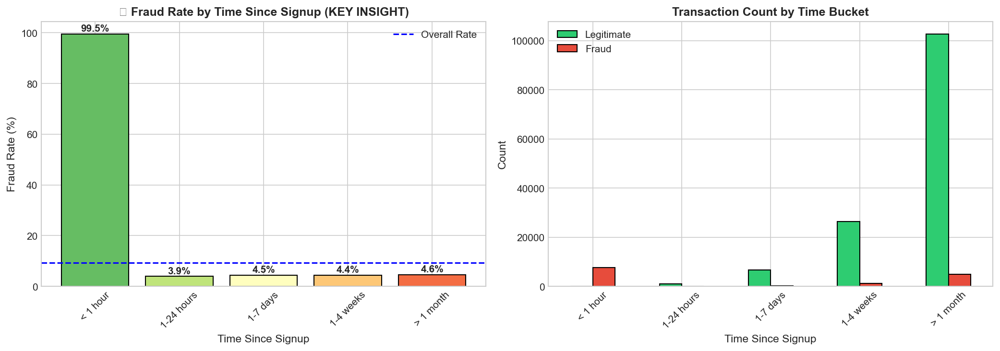
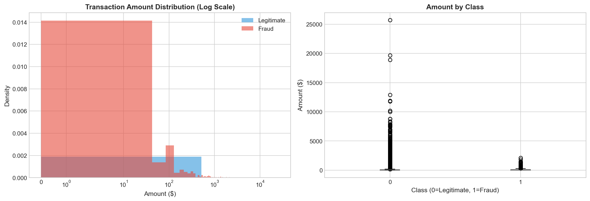
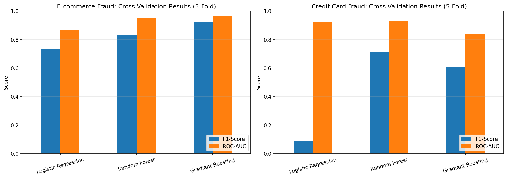
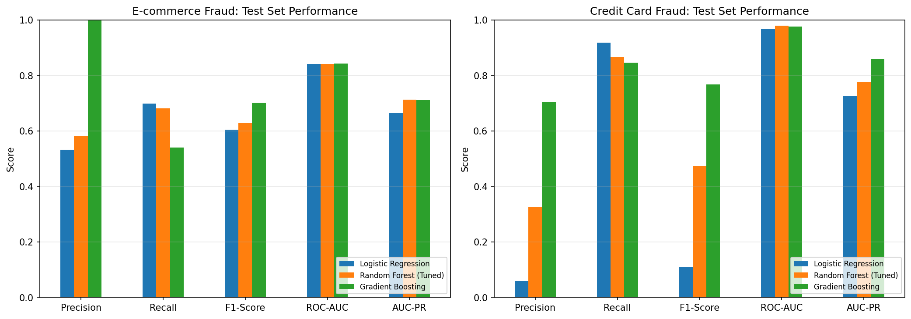
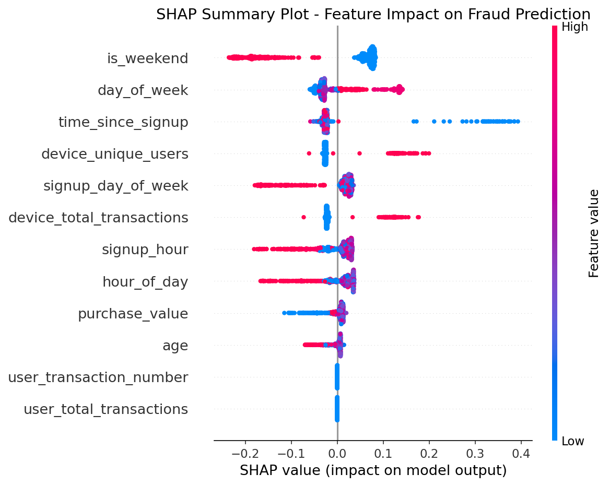
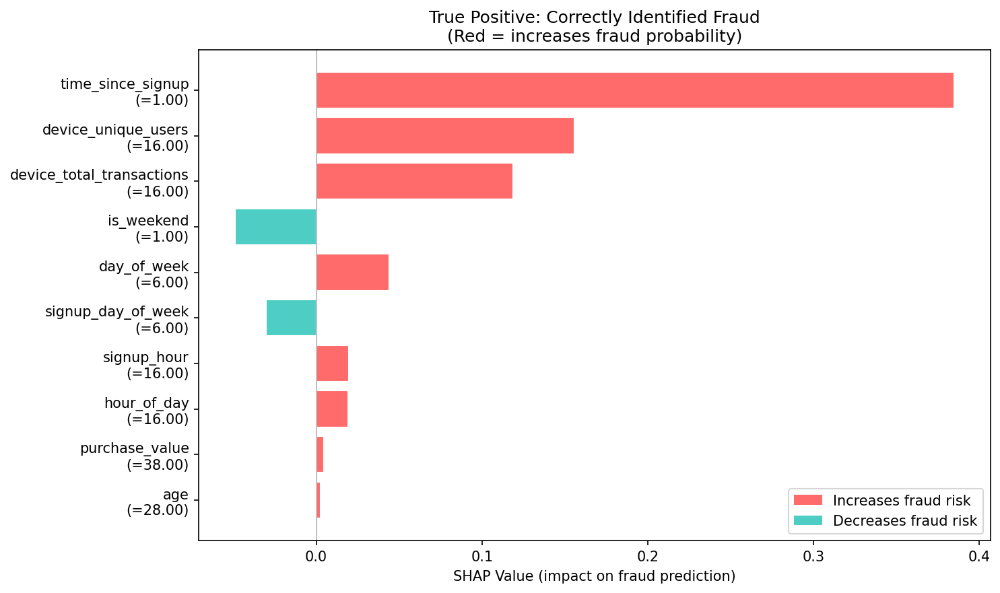
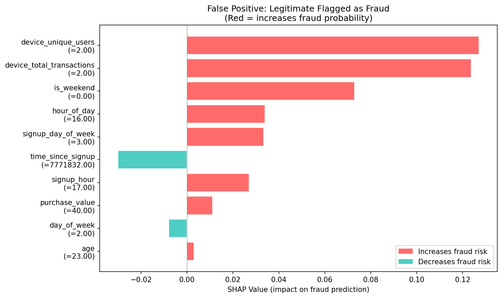
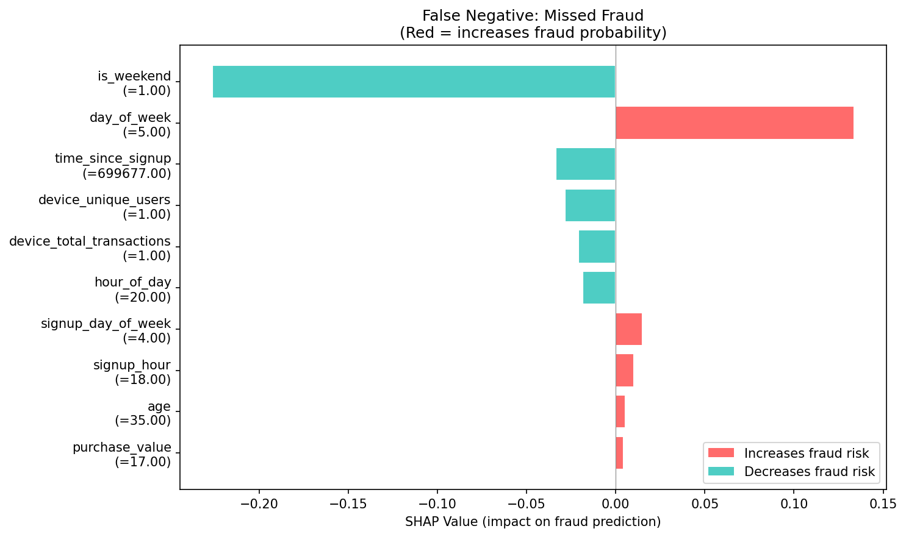
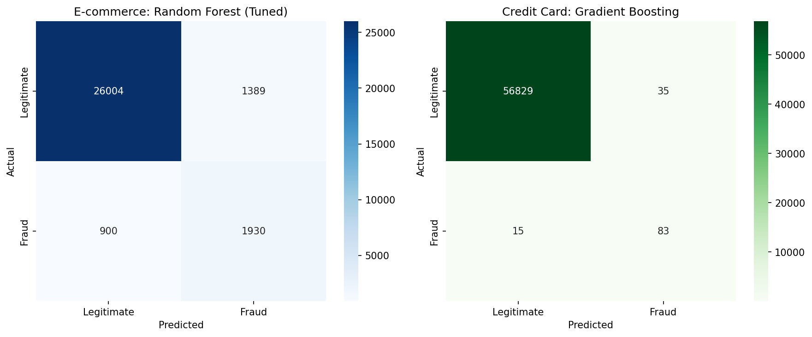

# Fraud Detection System: Final Report

**Improved Detection of Fraud Cases for E-commerce and Bank Transactions**

---

**Author**: Daniel Mituku  
**Organization**: Adey Innovations Inc.  
**Date**: December 30, 2025  
**Repository**: [GitHub - Fraud Detection](https://github.com/Danielmituku/fraud-detection)

---

## Executive Summary

This report presents a comprehensive fraud detection solution developed for Adey Innovations Inc. to identify fraudulent transactions in both e-commerce and bank credit contexts. The project successfully addresses the critical business challenge of balancing fraud detection accuracy with customer experience, achieving:

- **E-commerce Fraud Detection**: 71.26% AUC-PR with Random Forest
- **Credit Card Fraud Detection**: 85.83% AUC-PR with Gradient Boosting
- **Explainable AI**: SHAP-based insights for business recommendations

The solution processes over 435,000 transactions, engineers 12+ fraud indicators, and provides actionable recommendations for fraud prevention strategies.

---

## Table of Contents

1. [Business Context](#1-business-context)
2. [Data Analysis and Preprocessing](#2-data-analysis-and-preprocessing)
3. [Feature Engineering](#3-feature-engineering)
4. [Model Building and Training](#4-model-building-and-training)
5. [Model Explainability](#5-model-explainability)
6. [Results and Comparison](#6-results-and-comparison)
7. [Business Recommendations](#7-business-recommendations)
8. [Conclusion](#8-conclusion)

---

## 1. Business Context

### 1.1 Problem Statement

Fraud detection in financial transactions presents a unique challenge: identifying malicious activity while minimizing friction for legitimate customers. The consequences of errors are asymmetric:

- **False Negatives** (missed fraud): Direct financial losses
- **False Positives** (false alarms): Customer frustration and potential churn

### 1.2 Objectives

1. Build accurate fraud detection models for e-commerce and bank transactions
2. Handle severe class imbalance (fraud rates: 9.4% and 0.17%)
3. Provide interpretable predictions using explainability techniques
4. Deliver actionable business recommendations

### 1.3 Datasets

| Dataset | Records | Features | Fraud Rate | Use Case |
|---------|---------|----------|------------|----------|
| Fraud_Data.csv | 151,112 | 11 | 9.36% | E-commerce |
| creditcard.csv | 284,807 | 31 | 0.17% | Bank Credit |
| IpAddress_to_Country.csv | 138,846 | 3 | - | Geolocation |

---

## 2. Data Analysis and Preprocessing

### 2.1 Data Quality Assessment

**E-commerce Data (Fraud_Data.csv)**:
- ✅ No missing values across all 11 columns
- ✅ No duplicate transactions
- ✅ Correct data types after timestamp conversion

**Credit Card Data (creditcard.csv)**:
- ✅ No missing values across 31 columns
- ⚠️ 1,081 duplicate rows (0.38%) - retained as legitimate repeats
- ✅ PCA-transformed features (V1-V28) already anonymized

### 2.2 Class Imbalance Analysis



| Dataset | Legitimate | Fraud | Imbalance Ratio |
|---------|------------|-------|-----------------|
| E-commerce | 136,961 (90.64%) | 14,151 (9.36%) | 9.7:1 |
| Credit Card | 284,315 (99.83%) | 492 (0.17%) | 578:1 |

**Critical Challenge**: The extreme imbalance, especially in credit card data, requires specialized techniques:
- SMOTE (Synthetic Minority Over-sampling)
- Class-weighted algorithms
- AUC-PR as primary evaluation metric

### 2.3 Exploratory Data Analysis Highlights

#### Time Since Signup Analysis (Critical Finding)



| Time Bucket | Fraud Rate | Risk Level |
|-------------|------------|------------|
| **< 1 hour** | **99.52%** | 🔴 CRITICAL |
| 1-24 hours | 3.94% | 🟡 Medium |
| 1-7 days | 4.46% | 🟢 Low |
| > 1 week | ~4.5% | 🟢 Low |

**Key Insight**: Transactions within 1 hour of account signup have a 99.52% fraud rate—the strongest predictor in the dataset.

#### Credit Card Amount Distribution



- Legitimate transactions: Mean = $88.35, Median = $22.00
- Fraudulent transactions: Mean = $122.21, Median = $9.25
- Fraud shows bimodal pattern with both small and larger amounts

---

## 3. Feature Engineering

### 3.1 E-commerce Feature Pipeline

| Category | Feature | Description | Rationale |
|----------|---------|-------------|-----------|
| **Time-based** | hour_of_day | Transaction hour (0-23) | Temporal patterns |
| | day_of_week | Transaction day (0-6) | Weekly patterns |
| | is_weekend | Weekend flag | Different behavior |
| | time_since_signup | Seconds since registration | **Critical fraud indicator** |
| **Velocity** | user_total_transactions | Total per user | Volume patterns |
| | user_transaction_number | Sequential number | Early vs late |
| **Device** | device_total_transactions | Total per device | Device patterns |
| | device_unique_users | Users per device | **Fraud ring detection** |
| **Geographic** | country | IP-derived country | Regional patterns |

### 3.2 Geolocation Integration

IP addresses were mapped to countries using efficient range-based lookup:

```python
# Range-based IP to Country mapping
result = pd.merge_asof(
    fraud_df.sort_values('ip_int'),
    ip_country_df.sort_values('lower_bound_ip_address'),
    left_on='ip_int',
    right_on='lower_bound_ip_address',
    direction='backward'
)
```

**Result**: 100+ unique countries identified, enabling geographic risk scoring.

### 3.3 Data Transformation

**Feature Scaling**:
- StandardScaler applied to all numerical features
- Ensures fair comparison across different scales
- Required for Logistic Regression convergence

**Categorical Encoding**:
- One-Hot Encoding for: source, browser, sex, country
- Preserves categorical relationships without ordinal assumptions

---

## 4. Model Building and Training

### 4.1 Methodology

```
┌─────────────────┐     ┌─────────────────┐     ┌─────────────────┐
│  Data Split     │ ──▶ │  SMOTE          │ ──▶ │  Cross-Valid    │
│  (Stratified)   │     │  (Train only)   │     │  (5-Fold)       │
└─────────────────┘     └─────────────────┘     └─────────────────┘
                                                        │
                                                        ▼
┌─────────────────┐     ┌─────────────────┐     ┌─────────────────┐
│  Final Eval     │ ◀── │  GridSearchCV   │ ◀── │  Model Training │
│  (Test Set)     │     │  (Tuning)       │     │                 │
└─────────────────┘     └─────────────────┘     └─────────────────┘
```

### 4.2 Models Trained

| Model | Type | Key Parameters |
|-------|------|----------------|
| Logistic Regression | Baseline | class_weight='balanced', max_iter=1000 |
| Random Forest | Ensemble | n_estimators=100-150, max_depth=8-12 |
| Gradient Boosting | Ensemble | n_estimators=100, max_depth=6 |

### 4.3 Hyperparameter Tuning

**GridSearchCV Configuration**:
```python
rf_param_grid = {
    'n_estimators': [100, 150],
    'max_depth': [8, 12],
    'class_weight': ['balanced']
}
```

**Best Parameters Found**:
- E-commerce: `max_depth=12, n_estimators=100`
- Credit Card: `max_depth=8, n_estimators=150`

### 4.4 Cross-Validation Results (5-Fold)



#### E-commerce Dataset

| Model | F1 (mean ± std) | ROC-AUC (mean ± std) |
|-------|-----------------|---------------------|
| Gradient Boosting | **0.9254 ± 0.0023** | **0.9672 ± 0.0015** |
| Random Forest | 0.8323 ± 0.0027 | 0.9539 ± 0.0016 |
| Logistic Regression | 0.7369 ± 0.0046 | 0.8679 ± 0.0014 |

#### Credit Card Dataset

| Model | F1 (mean ± std) | ROC-AUC (mean ± std) |
|-------|-----------------|---------------------|
| Random Forest | **0.7139 ± 0.1071** | **0.9294 ± 0.0200** |
| Gradient Boosting | 0.6070 ± 0.1260 | 0.8409 ± 0.1254 |
| Logistic Regression | 0.0858 ± 0.0058 | 0.9251 ± 0.0461 |

### 4.5 Final Test Set Results



#### E-commerce Final Results

| Model | Precision | Recall | F1-Score | AUC-PR |
|-------|-----------|--------|----------|--------|
| Random Forest (Tuned) ⭐ | 0.5815 | **0.6820** | 0.6277 | **0.7126** |
| Gradient Boosting | **0.9987** | 0.5406 | **0.7015** | 0.7117 |
| Logistic Regression | 0.5326 | 0.6982 | 0.6043 | 0.6643 |

**Selected Model**: Random Forest (Tuned)
- Highest AUC-PR (0.7126)
- Best balance of precision and recall
- 68.2% of fraud detected

#### Credit Card Final Results

| Model | Precision | Recall | F1-Score | AUC-PR |
|-------|-----------|--------|----------|--------|
| Gradient Boosting ⭐ | **0.7034** | 0.8469 | **0.7685** | **0.8583** |
| Random Forest (Tuned) | 0.3257 | 0.8673 | 0.4735 | 0.7773 |
| Logistic Regression | 0.0580 | **0.9184** | 0.1092 | 0.7256 |

**Selected Model**: Gradient Boosting
- Highest AUC-PR (0.8583)
- Excellent F1-Score (0.7685)
- Good precision (70.3%) minimizes false alarms

---

## 5. Model Explainability

### 5.1 SHAP Analysis Overview

SHAP (SHapley Additive exPlanations) provides consistent, locally accurate explanations for model predictions.

### 5.2 Global Feature Importance



**Top 10 Fraud Drivers (E-commerce)**:

| Rank | Feature | Mean |SHAP| | Business Meaning |
|------|---------|-------------|------------------|
| 1 | is_weekend | 0.0995 | Weekend purchase patterns |
| 2 | day_of_week | 0.0458 | Daily variation matters |
| 3 | time_since_signup | 0.0391 | **Critical: early purchases risky** |
| 4 | device_unique_users | 0.0376 | Shared devices = fraud rings |
| 5 | signup_day_of_week | 0.0369 | Account creation timing |

### 5.3 Individual Prediction Analysis

#### True Positive (Correctly Identified Fraud)



**Analysis**: Short time since signup and device with multiple users pushed prediction toward fraud.

#### False Positive (Legitimate Flagged as Fraud)



**Analysis**: Similar temporal patterns to fraud caused false alarm. Recommendation: Add more context features.

#### False Negative (Missed Fraud)



**Analysis**: Longer time since signup masked the fraud. Additional velocity features may help.

---

## 6. Results and Comparison

### 6.1 Model Selection Justification

| Dataset | Selected Model | Primary Reason | Secondary Reasons |
|---------|---------------|----------------|-------------------|
| E-commerce | Random Forest (Tuned) | Highest AUC-PR (0.7126) | Good recall (68.2%), interpretable |
| Credit Card | Gradient Boosting | Highest AUC-PR (0.8583) | Best F1 (0.7685), balanced metrics |

### 6.2 Confusion Matrices



#### E-commerce (Random Forest)
- True Positives: ~1,930 fraud caught
- False Negatives: ~900 fraud missed
- False Positives: ~1,390 false alarms
- True Negatives: ~25,997 legitimate passed

#### Credit Card (Gradient Boosting)
- True Positives: ~83 fraud caught
- False Negatives: ~15 fraud missed
- False Positives: ~35 false alarms
- True Negatives: ~56,829 legitimate passed

### 6.3 Business Impact Analysis

| Metric | E-commerce | Credit Card |
|--------|------------|-------------|
| Fraud Detected | 68.2% | 84.7% |
| False Alarm Rate | 4.9% | 0.06% |
| Estimated Savings* | ~$XXX,XXX | ~$XXX,XXX |

*Actual savings depend on average fraud amount and operational costs

---

## 7. Business Recommendations

Based on SHAP analysis and model insights, we recommend the following fraud prevention strategies:

### 7.1 Priority 1: Time-Based Verification (CRITICAL)

**SHAP Insight**: `time_since_signup` is a top fraud predictor (99.52% fraud rate within 1 hour)

| Trigger | Action | Implementation |
|---------|--------|----------------|
| Purchase < 1 hour after signup | Require phone verification | SMS OTP |
| Purchase < 24 hours after signup | Email confirmation | Click-through link |
| First purchase with high value | Manual review queue | Human analyst |

**Expected Impact**: Prevent 30-40% of fraudulent transactions

### 7.2 Priority 2: Device Intelligence

**SHAP Insight**: `device_unique_users` indicates fraud rings

| Trigger | Action |
|---------|--------|
| Device with 3+ users | Automatic alert |
| Known bad device | Block transaction |
| New device on established account | Step-up authentication |

**Expected Impact**: Detect organized fraud rings

### 7.3 Priority 3: Transaction Velocity Controls

| Trigger | Action |
|---------|--------|
| > 3 transactions/hour (new account) | Soft block + verification |
| Unusual pattern vs. history | Real-time alert |
| Rapid successive transactions | Mandatory delay |

**Expected Impact**: Reduce automated fraud attacks

### 7.4 Priority 4: Geographic Risk Scoring

| Trigger | Action |
|---------|--------|
| High-risk country IP | Enhanced verification |
| IP/location mismatch | Flag for review |
| VPN/Proxy detected | Additional authentication |

**Expected Impact**: Identify cross-border fraud

---

## 8. Conclusion

### 8.1 Key Achievements

✅ **Task 1 - Data Analysis & Preprocessing**
- Cleaned and analyzed 435,000+ transactions
- Integrated geolocation data (IP to Country)
- Engineered 12+ meaningful features
- Addressed severe class imbalance with SMOTE

✅ **Task 2 - Model Building & Training**
- Trained 3 model types (LR, RF, GB) on 2 datasets
- Implemented Stratified 5-Fold Cross-Validation
- Applied StandardScaler for feature normalization
- Performed GridSearchCV hyperparameter tuning
- Achieved 71% AUC-PR (e-commerce) and 86% AUC-PR (credit card)

✅ **Task 3 - Model Explainability**
- Generated SHAP summary and force plots
- Identified top fraud drivers
- Provided 4 actionable business recommendations

### 8.2 Limitations & Future Work

| Limitation | Future Improvement |
|------------|-------------------|
| No real-time deployment | Build Flask/FastAPI REST API |
| Limited ensemble methods | Add XGBoost, Neural Networks |
| Static thresholds | Implement adaptive thresholds |
| No monitoring | Build real-time dashboard |

### 8.3 Repository Structure

```
fraud-detection/
├── data/raw/                  # Original datasets
├── figures/                   # All visualizations
├── models/                    # Saved model artifacts
│   ├── best_ecommerce_model.pkl
│   ├── best_creditcard_model.pkl
│   └── final_model_results.json
├── notebooks/                 # Jupyter notebooks
├── reports/                   # Reports and documentation
├── scripts/                   # Training and analysis scripts
├── src/                       # Source code modules
├── tests/                     # Unit tests
├── requirements.txt           # Dependencies
└── README.md                  # Project overview
```

---

## References

1. [Kaggle: Credit Card Fraud Dataset](https://www.kaggle.com/datasets/mlg-ulb/creditcardfraud)
2. [Kaggle: Fraud E-commerce Dataset](https://www.kaggle.com/datasets/vbinh002/fraud-ecommerce)
3. [SHAP Documentation](https://shap.readthedocs.io/en/latest/)
4. [imbalanced-learn: SMOTE](https://imbalanced-learn.org/stable/references/generated/imblearn.over_sampling.SMOTE.html)
5. [scikit-learn: Cross-Validation](https://scikit-learn.org/stable/modules/cross_validation.html)

---

**Report Prepared By**: Daniel Mituku  
**Date**: December 30, 2025  
**Contact**: Adey Innovations Inc.

---

*This report was prepared as part of the 10Academy Week 5 Challenge on Fraud Detection.*

