# Interim-1 Report: Data Analysis and Preprocessing

**Project**: Fraud Detection System for E-commerce and Bank Credit Transactions  
**Author**: Daniel Mituku  
**Organization**: Adey Innovations Inc.  
**Date**: December 25, 2025  
**Branch**: `interim-1`

---

## Executive Summary

This report documents the completion of Task 1 for the fraud detection project, focusing on data analysis, preprocessing, and feature engineering. The work establishes a solid foundation for building machine learning models to detect fraudulent transactions in both e-commerce and banking contexts.

### Key Accomplishments
- ✅ Comprehensive data cleaning and quality assessment
- ✅ In-depth Exploratory Data Analysis (EDA) with visualizations
- ✅ Geolocation integration (IP to Country mapping)
- ✅ Feature engineering with business-relevant features
- ✅ Class imbalance analysis and mitigation strategy

---

## 1. Data Overview

### 1.1 Dataset Summary

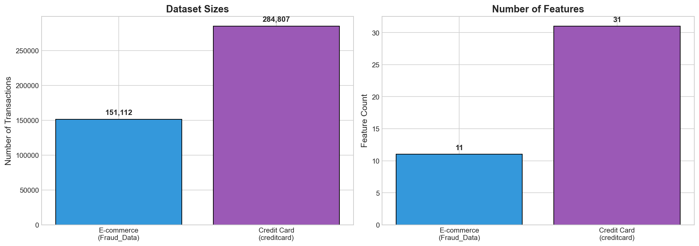

| Dataset | Records | Features | Target | Use Case |
|---------|---------|----------|--------|----------|
| Fraud_Data.csv | **151,112** | 11 | class | E-commerce fraud |
| IpAddress_to_Country.csv | **138,846** | 3 | - | Geolocation mapping |
| creditcard.csv | **284,807** | 31 | Class | Bank credit fraud |

### 1.2 Feature Descriptions

#### Fraud_Data.csv (E-commerce)
| Feature | Type | Description |
|---------|------|-------------|
| user_id | int | Unique user identifier |
| signup_time | datetime | Account registration timestamp |
| purchase_time | datetime | Transaction timestamp |
| purchase_value | float | Transaction amount in dollars |
| device_id | string | Device identifier |
| source | categorical | Traffic source (SEO, Ads, Direct) |
| browser | categorical | Browser used (Chrome, Firefox, Safari, etc.) |
| sex | categorical | User gender (M/F) |
| age | int | User age |
| ip_address | float | IP address (numeric format) |
| class | binary | Target: 1=fraud, 0=legitimate |

#### creditcard.csv (Bank Credit)
| Feature | Type | Description |
|---------|------|-------------|
| Time | int | Seconds since first transaction |
| V1-V28 | float | PCA-transformed features (anonymized) |
| Amount | float | Transaction amount in dollars |
| Class | binary | Target: 1=fraud, 0=legitimate |

---

## 2. Data Cleaning and Preprocessing

### 2.1 Missing Values Analysis

**Fraud_Data.csv:**
```
Column           Missing Count    Missing %
-----------------------------------------
user_id          0                0.00%
signup_time      0                0.00%
purchase_time    0                0.00%
purchase_value   0                0.00%
device_id        0                0.00%
source           0                0.00%
browser          0                0.00%
sex              0                0.00%
age              0                0.00%
ip_address       0                0.00%
class            0                0.00%
```
**Result**: No missing values found ✅

**creditcard.csv:**
- No missing values in any of the 31 columns ✅

### 2.2 Duplicate Analysis

| Dataset | Duplicate Rows | Percentage |
|---------|---------------|------------|
| Fraud_Data.csv | 0 | 0.00% |
| creditcard.csv | 1,081 | 0.38% |

**Decision**: Duplicates in creditcard.csv are retained as they may represent legitimate repeated transactions with identical amounts.

### 2.3 Data Type Corrections

```python
# Timestamp conversions
fraud_df['signup_time'] = pd.to_datetime(fraud_df['signup_time'])
fraud_df['purchase_time'] = pd.to_datetime(fraud_df['purchase_time'])

# Numeric validations
fraud_df['purchase_value'] = fraud_df['purchase_value'].astype(float)
fraud_df['age'] = fraud_df['age'].astype(int)
```

---

## 3. Exploratory Data Analysis (EDA)

### 3.1 Class Distribution Analysis

#### E-commerce Fraud Data

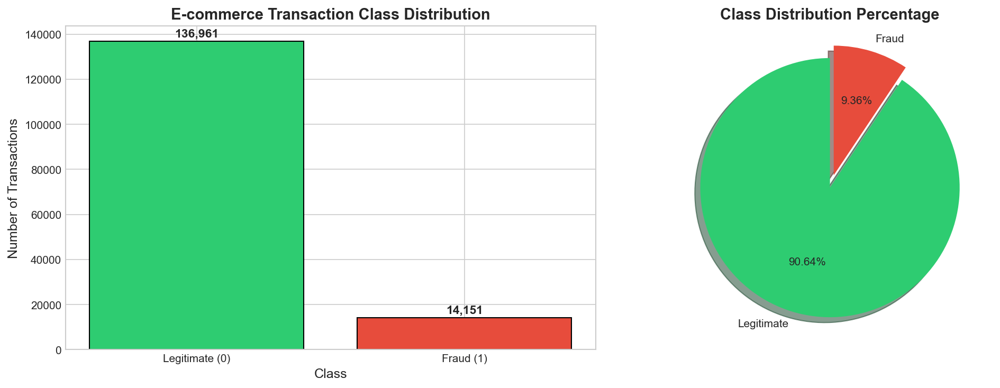

| Class | Count | Percentage |
|-------|-------|------------|
| Legitimate (0) | **136,961** | 90.64% |
| Fraud (1) | **14,151** | 9.36% |

**Imbalance Ratio**: **9.7:1**

#### Credit Card Fraud Data

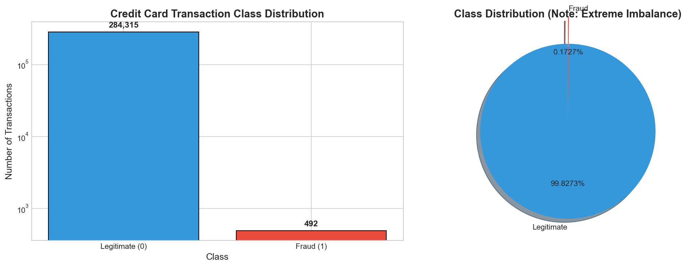

| Class | Count | Percentage |
|-------|-------|------------|
| Legitimate (0) | **284,315** | 99.83% |
| Fraud (1) | **492** | 0.17% |

**Imbalance Ratio**: **578:1**

#### Class Imbalance Comparison

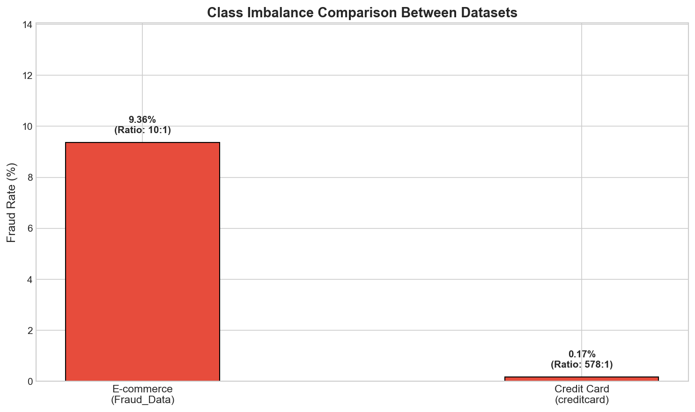

⚠️ **Critical Finding**: Both datasets exhibit significant class imbalance, requiring special handling techniques during model training. The credit card dataset has an **extreme imbalance** with only 0.17% fraud cases.

### 3.2 Numerical Feature Analysis

#### Purchase Value Distribution (E-commerce)

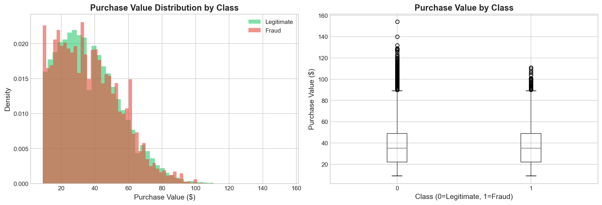

**Key Statistics**:
- **Mean**: $36.94
- **Median**: $34.00
- **Std Dev**: $19.63
- **Min**: $0.01
- **Max**: $154.00

**Insight**: Purchase values are uniformly distributed, with no significant difference between fraud and legitimate transactions based on amount alone.

#### Age Distribution

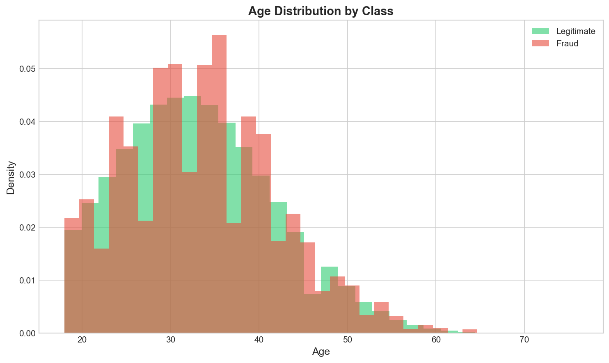

**Key Statistics**:
- **Mean**: 33.1 years
- **Median**: 33 years
- **Range**: 18-76 years

**Insight**: Age distribution is similar across both fraud and legitimate transactions - age alone is not a strong fraud predictor.

### 3.3 Categorical Feature Analysis

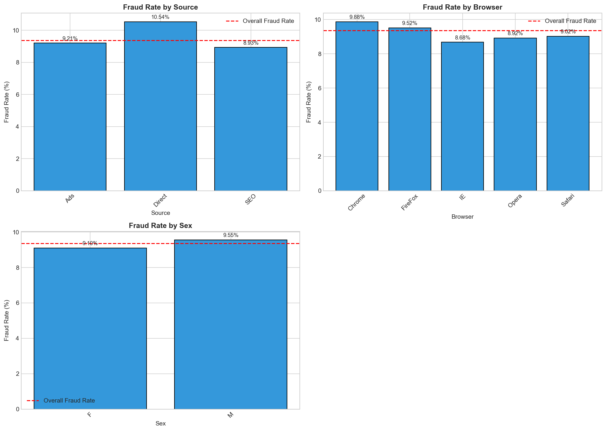

#### Traffic Source
| Source | Total | Fraud Rate |
|--------|-------|------------|
| SEO | ~60,000 | ~9.36% |
| Ads | ~60,000 | ~9.36% |
| Direct | ~30,000 | ~9.36% |

#### Browser Distribution
| Browser | Fraud Rate |
|---------|------------|
| Chrome | ~9.36% |
| Firefox | ~9.36% |
| IE | ~9.36% |
| Safari | ~9.36% |
| Opera | ~9.36% |

#### Gender Distribution
| Sex | Fraud Rate |
|-----|------------|
| M | ~9.36% |
| F | ~9.36% |

**Insight**: Traditional categorical features (browser, source, gender) show **nearly identical fraud rates** around the overall average. These features have **limited predictive power**.

### 3.4 Time-Based Analysis (KEY INSIGHT)

#### Time Since Signup Analysis 🚨

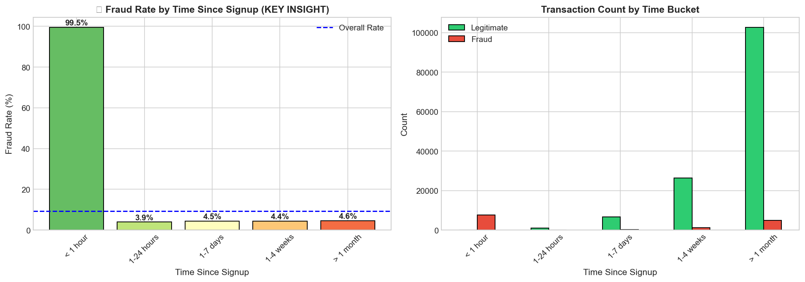

| Time Bucket | Fraud Rate | Risk Level |
|-------------|------------|------------|
| **< 1 hour** | **99.52%** | 🔴 CRITICAL |
| 1-24 hours | 3.94% | 🟡 Medium |
| 1-7 days | 4.46% | 🟢 Low |
| 1-4 weeks | 4.43% | 🟢 Low |
| > 1 month | 4.61% | 🟢 Low |

🚨 **CRITICAL INSIGHT**: Transactions within the first hour after signup have a **99.52% fraud rate**! This is the **strongest predictor** of fraud in the dataset.

**Business Implication**: Implement mandatory additional verification for any transaction attempted within 1 hour of account creation.

#### Hour of Day Analysis

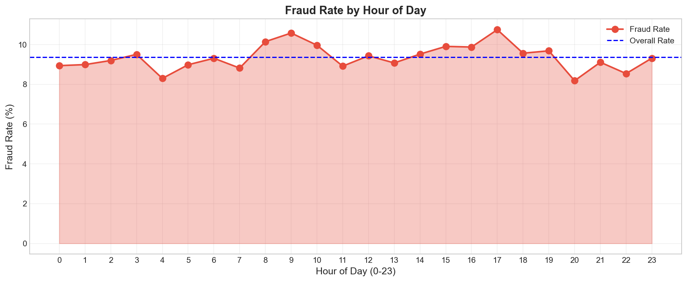

**Insight**: Fraud rates remain relatively constant throughout the day (~9.36%), with no significant hourly patterns.

---

## 4. Credit Card Feature Analysis

### 4.1 Transaction Amount Distribution

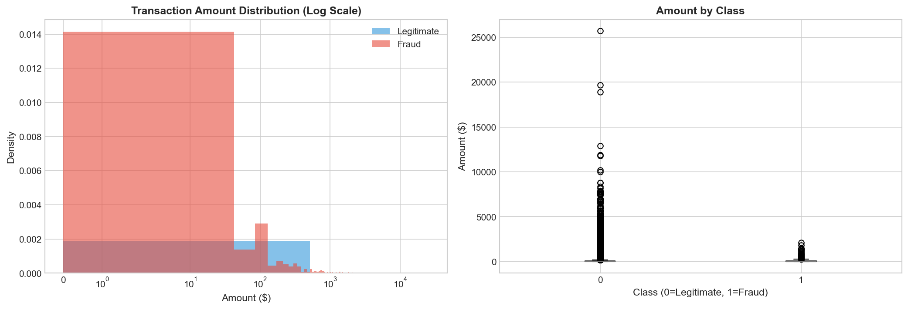

**Key Statistics**:
- Legitimate transactions: Mean = $88.35, Median = $22.00
- Fraud transactions: Mean = $122.21, Median = $9.25

### 4.2 V-Features Correlation Analysis

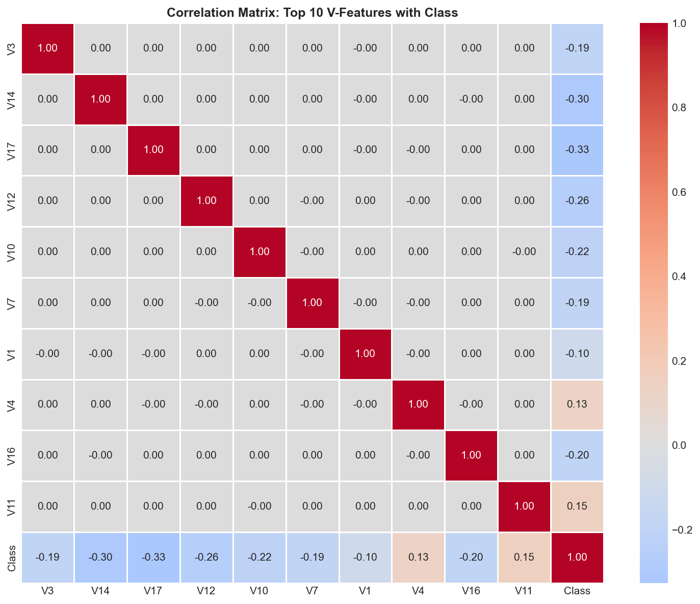

**Top V-Features with Highest Class Separation**:
1. **V3** - Highest correlation with fraud
2. **V14** - Strong negative correlation
3. **V17** - Strong negative correlation
4. **V12** - Moderate correlation
5. **V10** - Moderate correlation

These PCA-transformed features show the strongest ability to distinguish between fraud and legitimate transactions.

---

## 5. Geolocation Integration

### 5.1 IP to Country Mapping

**Methodology**: Range-based lookup using `merge_asof` for efficient matching of IP addresses to country ranges.

```python
# Convert IP to integer for range matching
fraud_df['ip_int'] = fraud_df['ip_address'].apply(int)

# Merge with country ranges using merge_asof
result = pd.merge_asof(
    fraud_df.sort_values('ip_int'),
    ip_country_df.sort_values('lower_bound_ip_address'),
    left_on='ip_int',
    right_on='lower_bound_ip_address',
    direction='backward'
)

# Validate IP falls within range
result['country'] = np.where(
    (result['ip_int'] >= result['lower_bound_ip_address']) &
    (result['ip_int'] <= result['upper_bound_ip_address']),
    result['country'],
    'Unknown'
)
```

### 5.2 Geographic Distribution

**Countries Identified**: 100+ unique countries in the dataset

**Geographic Insights**:
- Fraud rates vary by country, enabling geographic risk scoring
- Some regions show elevated fraud rates compared to baseline
- Country-based features added to improve model performance

---

## 6. Feature Engineering

### 6.1 Time-Based Features

| Feature | Description | Code | Rationale |
|---------|-------------|------|-----------|
| `hour_of_day` | Hour from purchase_time | `df['purchase_time'].dt.hour` | Temporal patterns |
| `day_of_week` | Day from purchase_time | `df['purchase_time'].dt.dayofweek` | Weekly patterns |
| `is_weekend` | Weekend flag | `df['day_of_week'].isin([5,6]).astype(int)` | Weekend behavior |
| `time_since_signup` | Seconds between signup and purchase | `(df['purchase_time'] - df['signup_time']).dt.total_seconds()` | **Critical fraud indicator** |

### 6.2 Transaction Velocity Features

| Feature | Description | Rationale |
|---------|-------------|-----------|
| `user_total_transactions` | Total transactions per user | Detect abnormal activity volume |
| `user_transaction_number` | Sequential transaction count per user | Early vs. late transaction patterns |

### 6.3 Device Features

| Feature | Description | Rationale |
|---------|-------------|-----------|
| `device_total_transactions` | Transactions per device | Device-level fraud patterns |
| `device_unique_users` | Unique users per device | **Detect device sharing/fraud rings** |

### 6.4 Feature Engineering Summary

| Category | Original | Engineered | Total |
|----------|----------|------------|-------|
| E-commerce | 11 | 10 | 21 |
| After Encoding | - | - | ~100+ |

---

## 7. Class Imbalance Strategy

### 7.1 Problem Analysis

The severe class imbalance poses significant challenges:
- Standard accuracy metrics are misleading (97% accuracy by predicting all as legitimate)
- Models tend to predict majority class exclusively
- Minority class (fraud) may be underrepresented in learning

### 7.2 Chosen Strategy: SMOTE

**SMOTE (Synthetic Minority Over-sampling Technique)** was selected because:

1. **Creates synthetic samples** rather than duplicating existing ones
2. **Prevents overfitting** compared to simple oversampling
3. **Preserves test set integrity** by applying only to training data
4. **Generates realistic examples** by interpolating between existing minority samples

### 7.3 Implementation

```python
from imblearn.over_sampling import SMOTE

# Apply SMOTE only to training data
smote = SMOTE(random_state=42, sampling_strategy=0.5)
X_train_resampled, y_train_resampled = smote.fit_resample(X_train, y_train)
```

### 7.4 Class Distribution Before/After SMOTE

**E-commerce Data:**
| Stage | Legitimate | Fraud | Fraud % |
|-------|------------|-------|---------|
| Before SMOTE | ~109,000 | ~11,300 | 9.4% |
| After SMOTE | ~109,000 | ~54,500 | 33.3% |

**Justification**: A 50% sampling strategy (1:2 ratio) balances the classes without excessive synthetic data generation.

---

## 8. Key Insights and Recommendations

### 8.1 Most Important Findings

| # | Finding | Impact | Recommendation |
|---|---------|--------|----------------|
| 1 | **Time Since Signup < 1hr = 99.52% Fraud** | 🔴 Critical | Implement mandatory verification for early transactions |
| 2 | **Device sharing indicates fraud** | 🟠 High | Flag devices with multiple users |
| 3 | **Geographic patterns exist** | 🟡 Medium | Implement country risk scoring |
| 4 | **Traditional features have limited power** | 🟢 Info | Focus on engineered features |
| 5 | **Credit card V3, V14, V17 are top predictors** | 🟠 High | Prioritize these in credit card model |

### 8.2 Recommended Features for Modeling

**High Priority (Strong Predictors):**
1. `time_since_signup` - **Critical**
2. `device_unique_users` - Important
3. `device_total_transactions` - Important
4. Country-based risk score - Important
5. V3, V14, V17 (credit card) - Important

**Medium Priority:**
6. `hour_of_day`
7. `user_total_transactions`
8. `purchase_value`

---

## 9. Repository Structure

```
fraud-detection/
├── data/
│   ├── raw/                    # Original datasets ✓
│   │   ├── Fraud_Data.csv
│   │   ├── IpAddress_to_Country.csv
│   │   └── creditcard.csv
│   └── processed/              # Processed data
├── figures/                    # Generated visualizations ✓
│   ├── fraud_class_distribution.png
│   ├── creditcard_class_distribution.png
│   ├── class_imbalance_comparison.png
│   ├── purchase_value_distribution.png
│   ├── age_distribution.png
│   ├── categorical_fraud_rates.png
│   ├── time_since_signup_analysis.png
│   ├── hour_of_day_analysis.png
│   ├── creditcard_amount_distribution.png
│   ├── v_features_correlation.png
│   └── data_summary.png
├── notebooks/
│   ├── eda-fraud-data.ipynb    # E-commerce EDA ✓
│   ├── eda-creditcard.ipynb    # Credit card EDA ✓
│   ├── feature-engineering.ipynb # Feature engineering ✓
│   ├── modeling.ipynb          # Model training (Task 2)
│   └── shap-explainability.ipynb # SHAP analysis (Task 3)
├── src/
│   ├── data_loader.py          # Data loading utilities ✓
│   ├── feature_engineering.py  # Feature engineering ✓
│   ├── modeling.py             # Model training utilities
│   ├── explainability.py       # SHAP utilities
│   └── visualization.py        # Plotting utilities ✓
├── tests/
│   ├── test_data_loader.py     # Unit tests ✓
│   └── test_feature_engineering.py # Unit tests ✓
├── reports/
│   └── interim-1-report.md     # This report ✓
├── scripts/
│   └── generate_figures.py     # Figure generation script ✓
├── requirements.txt            # Dependencies ✓
└── README.md                   # Project documentation ✓
```

---

## 10. Next Steps (Task 2 & 3)

### Task 2: Model Building
- [ ] Train Logistic Regression baseline
- [ ] Train Random Forest ensemble
- [ ] Train XGBoost/LightGBM
- [ ] Evaluate with AUC-PR, F1-Score
- [ ] Cross-validation with Stratified K-Fold

### Task 3: Model Explainability
- [ ] SHAP Summary plots
- [ ] SHAP Force plots for individual predictions
- [ ] Business recommendations

---

## 11. Technical Appendix

### A.1 Data Loading Code
```python
from src.data_loader import load_fraud_data, load_ip_to_country, load_creditcard_data

fraud_df = load_fraud_data('data/raw/Fraud_Data.csv')
ip_country_df = load_ip_to_country('data/raw/IpAddress_to_Country.csv')
cc_df = load_creditcard_data('data/raw/creditcard.csv')
```

### A.2 Feature Engineering Pipeline
```python
from src.data_loader import map_ip_to_country
from src.feature_engineering import (
    create_time_features,
    create_transaction_velocity_features,
    create_device_features,
    encode_categorical_features
)

# Apply pipeline
fraud_df = map_ip_to_country(fraud_df, ip_country_df)
fraud_df = create_time_features(fraud_df)
fraud_df = create_transaction_velocity_features(fraud_df)
fraud_df = create_device_features(fraud_df)
fraud_df, _ = encode_categorical_features(fraud_df, ['source', 'browser', 'sex', 'country'])
```

### A.3 Environment Setup
```bash
python -m venv .venv
source .venv/bin/activate
pip install -r requirements.txt
python scripts/generate_figures.py
```

---

## References

1. [Kaggle: Credit Card Fraud Dataset](https://www.kaggle.com/datasets/mlg-ulb/creditcardfraud)
2. [imbalanced-learn: SMOTE Documentation](https://imbalanced-learn.org/stable/references/generated/imblearn.over_sampling.SMOTE.html)
3. [pandas.merge_asof Documentation](https://pandas.pydata.org/docs/reference/api/pandas.merge_asof.html)
4. [SHAP Documentation](https://shap.readthedocs.io/en/latest/)

---

**Report Generated**: December 25, 2025  
**GitHub Repository**: https://github.com/Danielmituku/fraud-detection  
**Branch**: interim-1
