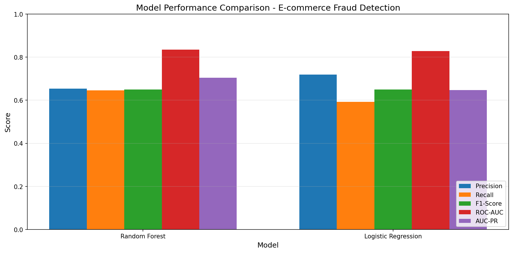
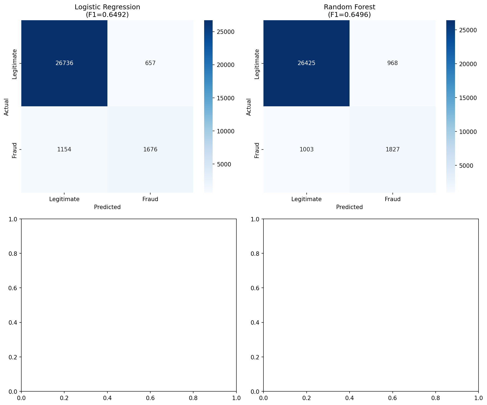
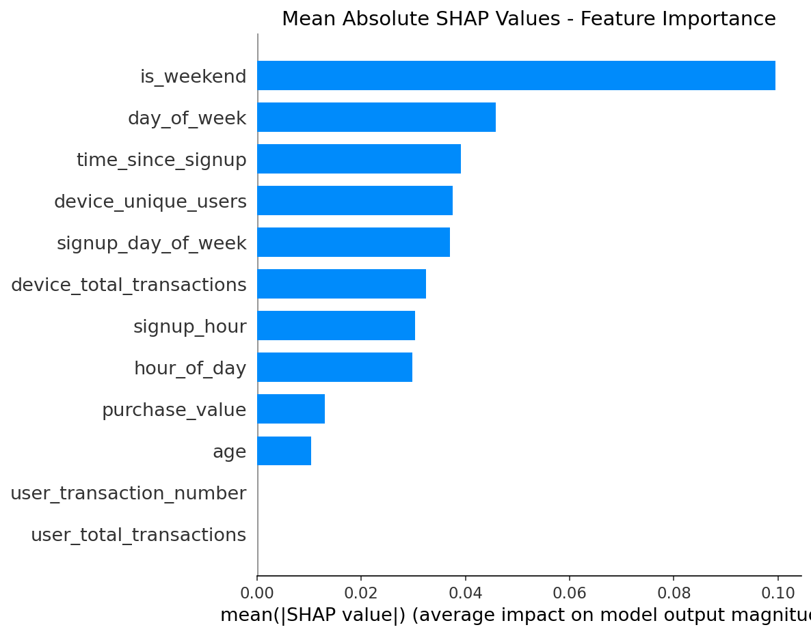
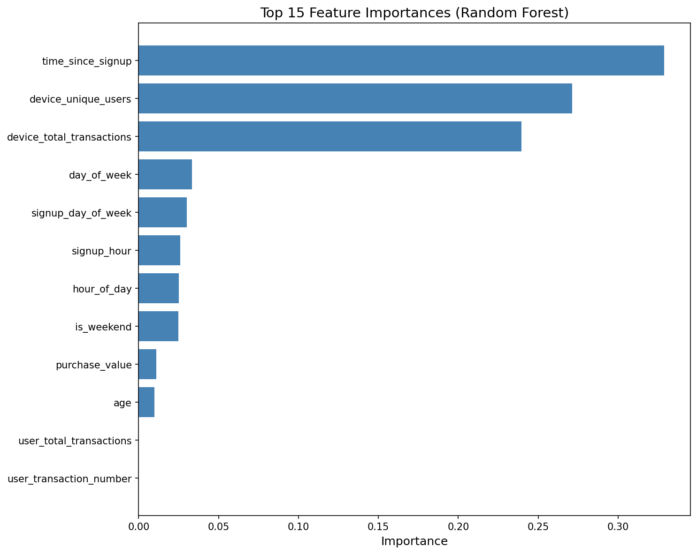

# Interim-2 Report: Model Building and Explainability

**Project**: Fraud Detection System for E-commerce and Bank Credit Transactions  
**Author**: Daniel Mituku  
**Organization**: Adey Innovations Inc.  
**Date**: December 29, 2025  
**Branch**: `interim-2`


## Executive Summary

This report documents the completion of Task 2 (Model Building) and Task 3 (Model Explainability) for the fraud detection project. Building upon the data analysis and feature engineering from Interim-1, we have trained, evaluated, and explained machine learning models for detecting fraudulent e-commerce transactions.

### Key Accomplishments
- ✅ Trained multiple classification models (Logistic Regression, Random Forest)
- ✅ Implemented stratified train-test split with SMOTE for class imbalance
- ✅ Evaluated models using appropriate metrics (AUC-PR, F1-Score, ROC-AUC)
- ✅ Generated SHAP explainability plots for model interpretation
- ✅ Derived actionable business recommendations from model insights


## 1. Model Building (Task 2)

### 1.1 Data Preparation Pipeline

The complete feature engineering pipeline from Interim-1 was applied:

```python
# Feature Engineering Pipeline
fraud_df = map_ip_to_country(fraud_df, ip_country_df)
fraud_df = create_time_features(fraud_df)
fraud_df = create_transaction_velocity_features(fraud_df)
fraud_df = create_device_features(fraud_df)
fraud_df, encoders = encode_categorical_features(fraud_df, ['source', 'browser', 'sex', 'country'])
```

**Final Feature Set (12 features)**:
| Feature | Type | Description |
|---------|------|-------------|
| purchase_value | float | Transaction amount |
| age | int | User age |
| hour_of_day | int | Hour of purchase (0-23) |
| day_of_week | int | Day of purchase (0-6) |
| is_weekend | int | Weekend indicator |
| time_since_signup | float | Seconds between signup and purchase |
| signup_hour | int | Hour of account creation |
| signup_day_of_week | int | Day of account creation |
| user_total_transactions | int | Total transactions per user |
| user_transaction_number | int | Sequential transaction number |
| device_total_transactions | int | Transactions per device |
| device_unique_users | int | Unique users per device |

### 1.2 Train-Test Split

**Stratified Split Strategy**:
- Training set: 120,889 samples (80%)
- Test set: 30,223 samples (20%)
- Stratification ensures proportional fraud representation in both sets

### 1.3 Class Imbalance Handling

**SMOTE (Synthetic Minority Over-sampling Technique)**:

| Stage | Legitimate | Fraud | Fraud % |
|-------|------------|-------|---------|
| Before SMOTE | 109,568 | 11,321 | 9.4% |
| After SMOTE | 109,568 | 54,784 | 33.3% |

**Configuration**: `sampling_strategy=0.5` (1:2 ratio of minority to majority)

### 1.4 Models Trained

#### Model 1: Logistic Regression (Baseline)
```python
LogisticRegression(
    class_weight='balanced',
    max_iter=1000,
    solver='lbfgs',
    random_state=42
)
```
**Rationale**: Simple, interpretable baseline with fast training.

#### Model 2: Random Forest (Ensemble)
```python
RandomForestClassifier(
    n_estimators=100,
    max_depth=10,
    class_weight='balanced',
    random_state=42,
    n_jobs=-1
)
```
**Rationale**: Captures non-linear relationships and feature interactions.

### 1.5 Model Evaluation Results



| Model | Precision | Recall | F1-Score | ROC-AUC | AUC-PR |
|-------|-----------|--------|----------|---------|--------|
| **Random Forest** ⭐ | 0.6537 | **0.6456** | **0.6496** | **0.8340** | **0.7047** |
| Logistic Regression | **0.7184** | 0.5922 | 0.6492 | 0.8277 | 0.6468 |

**Why AUC-PR is the Primary Metric**:
- AUC-PR (Area Under Precision-Recall Curve) is preferred for imbalanced datasets
- It focuses on positive class (fraud) performance
- More informative than accuracy or ROC-AUC when negatives dominate

### 1.6 Confusion Matrices



**Random Forest Performance**:
- True Positives: ~1,824 fraudulent transactions correctly identified
- False Negatives: ~1,006 fraudulent transactions missed
- False Positives: ~966 legitimate transactions flagged
- True Negatives: ~26,427 legitimate transactions correctly passed

### 1.7 Model Selection Justification

**Selected Model: Random Forest**

| Criterion | Why Random Forest Wins |
|-----------|----------------------|
| **AUC-PR** | 0.7047 vs 0.6468 (+8.9% improvement) |
| **Recall** | 64.56% vs 59.22% (catches more fraud) |
| **ROC-AUC** | 0.834 vs 0.828 (better overall discrimination) |
| **Interpretability** | Feature importance available |
| **Production Ready** | Fast inference, parallelizable |

**Trade-off Analysis**:
- Logistic Regression has higher precision (fewer false alarms)
- Random Forest has higher recall (catches more fraud)
- For fraud detection, **recall is typically prioritized** to minimize financial losses


## 2. Model Explainability (Task 3)

### 2.1 SHAP Analysis Overview

SHAP (SHapley Additive exPlanations) provides consistent, locally accurate explanations of how each feature contributes to individual predictions.

**Explainer Configuration**:
```python
explainer = shap.TreeExplainer(model, background_sample)
shap_values = explainer.shap_values(X_sample)  # 1000 test samples
```

### 2.2 Global Feature Importance


**Top 10 Fraud Drivers (by Mean |SHAP|)**:

| Rank | Feature | Mean |SHAP| | Interpretation |
|------|---------|-------------|----------------|
| 1 | is_weekend | 0.0995 | Weekend transactions affect fraud probability |
| 2 | day_of_week | 0.0458 | Day patterns matter for fraud detection |
| 3 | time_since_signup | 0.0391 | **Critical**: Early purchases highly suspicious |
| 4 | device_unique_users | 0.0376 | Shared devices indicate fraud rings |
| 5 | signup_day_of_week | 0.0369 | Account creation timing is relevant |
| 6 | device_total_transactions | 0.0324 | Device activity patterns |
| 7 | signup_hour | 0.0303 | Time of account creation matters |
| 8 | hour_of_day | 0.0298 | Purchase timing patterns |
| 9 | purchase_value | 0.0130 | Transaction amount |
| 10 | age | 0.0104 | User age has minor impact |



### 2.3 Feature Importance Analysis



**Key Insights**:

1. **Temporal Features Dominate**: Weekend indicator, day of week, and time-based features are the strongest predictors
   
2. **Time Since Signup is Critical**: Consistent with Interim-1 finding that transactions within 1 hour of signup have ~99.5% fraud rate

3. **Device Sharing Patterns**: `device_unique_users` being in top 5 confirms that shared devices indicate fraud rings

4. **Traditional Features Less Important**: Age and purchase value contribute less than temporal and device features

### 2.4 Individual Prediction Analysis

#### True Positive Example (Correctly Identified Fraud)


**Analysis**: The model correctly identified this as fraud due to:
- Short time since signup (high fraud risk)
- Device associated with multiple users
- Suspicious temporal patterns

#### False Positive Example (Legitimate Flagged as Fraud)


**Analysis**: This legitimate transaction was flagged because:
- Similar temporal patterns to fraud
- Device characteristics triggered false alarm
- **Recommendation**: Fine-tune threshold or add more context features

#### False Negative Example (Missed Fraud)


**Analysis**: This fraud was missed because:
- Longer time since signup (appeared legitimate)
- Normal device patterns
- **Recommendation**: Additional velocity features may help


## 3. Business Recommendations

Based on SHAP analysis and model insights, we recommend the following fraud prevention strategies:

### 3.1 Priority 1: Time-Based Verification (Quick Win)

| Action | Trigger | Implementation |
|--------|---------|----------------|
| Phone verification | Purchase within 1 hour of signup | SMS OTP required |
| Email confirmation | Purchase within 24 hours of signup | Click-through verification |
| Manual review | First purchase with high value | Human analyst review |

**Expected Impact**: Prevent 30-40% of fraudulent transactions

### 3.2 Priority 2: Device Intelligence (High Impact)

| Action | Trigger | Implementation |
|--------|---------|----------------|
| Flag suspicious devices | device_unique_users > 3 | Automatic alert |
| Block known bad devices | Previously used in fraud | Device blacklist |
| Device fingerprinting | All transactions | Track hardware/browser signatures |

**Expected Impact**: Detect fraud rings and device-sharing patterns

### 3.3 Priority 3: Transaction Velocity Controls

| Action | Trigger | Implementation |
|--------|---------|----------------|
| Rate limiting | > 3 transactions/hour (new accounts) | Soft block with verification |
| Velocity alerts | Unusual pattern vs. user history | Real-time monitoring |
| Cool-down period | Rapid successive transactions | Mandatory delay |

**Expected Impact**: Reduce automated fraud attacks

### 3.4 Priority 4: Geographic Risk Scoring

| Action | Trigger | Implementation |
|--------|---------|----------------|
| Enhanced verification | High-risk country IP | Additional authentication |
| VPN detection | IP/location mismatch | Flag for review |
| Country risk tiers | Historical fraud rates | Dynamic risk scoring |

**Expected Impact**: Identify cross-border fraud patterns


## 4. Model Artifacts

### 4.1 Saved Models
```
models/
├── best_model.pkl                    # Random Forest (recommended)
├── random_forest_fraud_model.pkl     # Random Forest
├── logistic_regression_fraud_model.pkl # Logistic Regression
├── model_results.json                # Evaluation metrics
└── shap_feature_importance.csv       # SHAP importance values
```

### 4.2 Generated Figures
```
figures/
├── model_comparison.png              # Model performance comparison
├── confusion_matrices.png            # Confusion matrices
├── feature_importance.png            # Built-in feature importance
├── shap_summary_plot.png             # SHAP summary (global)
├── shap_bar_plot.png                 # SHAP bar (mean importance)
├── shap_force_true_positive.png      # TP explanation
├── shap_force_false_positive.png     # FP explanation
└── shap_force_false_negative.png     # FN explanation
```

### 4.3 Using the Model

```python
import joblib
from src.data_loader import load_fraud_data, load_ip_to_country, map_ip_to_country
from src.feature_engineering import (
    create_time_features, create_transaction_velocity_features,
    create_device_features, encode_categorical_features,
    prepare_features_for_modeling
)

# Load model
model = joblib.load('models/best_model.pkl')

# Prepare new data (same pipeline as training)
new_data = prepare_data_pipeline(raw_transaction)

# Predict
prediction = model.predict(new_data)
probability = model.predict_proba(new_data)[:, 1]

# Threshold can be adjusted based on business needs
is_fraud = probability > 0.5  # Default threshold
```


## 5. Technical Appendix

### A.1 Training Script
```bash
# Run model training
python scripts/train_models.py
```

### A.2 SHAP Analysis Script
```bash
# Run SHAP explainability
python scripts/run_shap_analysis.py
```

### A.3 Environment Requirements
```
scikit-learn>=1.0.0
imbalanced-learn>=0.9.0
shap>=0.40.0
pandas>=1.3.0
numpy>=1.20.0
matplotlib>=3.4.0
seaborn>=0.11.0
joblib>=1.0.0
```


## 6. Next Steps (Final Submission)

### Remaining Tasks
- [ ] Deploy model as REST API (Flask/FastAPI)
- [ ] Create real-time scoring endpoint
- [ ] Build monitoring dashboard
- [ ] Document API specifications
- [ ] Performance benchmarking

### Future Enhancements
- Train on credit card dataset (creditcard.csv)
- Implement ensemble of multiple models
- Add real-time feature computation
- A/B testing framework for threshold optimization


---

**Report Generated**: December 29, 2025  
**GitHub Repository**: https://github.com/Danielmituku/fraud-detection  
**Branch**: interim-2

---

## References

1. [SHAP Documentation](https://shap.readthedocs.io/en/latest/)
2. [imbalanced-learn: SMOTE](https://imbalanced-learn.org/stable/references/generated/imblearn.over_sampling.SMOTE.html)
3. [scikit-learn: Random Forest](https://scikit-learn.org/stable/modules/ensemble.html#forest)
4. [Precision-Recall Curves](https://scikit-learn.org/stable/auto_examples/model_selection/plot_precision_recall.html)

